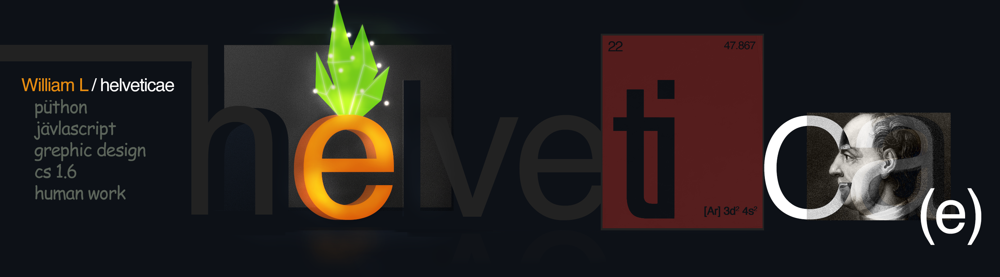

### William Akilles Lindstedt
AI & ML Student interested in data science.

---

Junior programmer with passion for design, music and really any kind of art, including math, and sometimes, although rarely, post-post modern irony.

Currently participating in global capitalism, but I mostly like [construction and management simulations](https://en.wikipedia.org/wiki/Construction_and_management_simulation), [old-school RPGs](https://en.wikipedia.org/wiki/Pokémon_(video_game_series)#First_generation_(1996–1999)) and [4X-games](https://en.wikipedia.org/wiki/4X). Oh and I guess Binance is a game by now.
 

### GitHub portfolio

| Repo                           | Description                        |
| ------------------------------ | ---------------------------------- |
| [Python][py]            | Projects in Python              |
| [Artificial intellignece][py]         | Projects on AI
| [Legendary Waffle][lw] | Game projcet in .py          |

[py]: https://github.com/helveticae/ITHS
[lw]: https://github.com/helveticae/legendary-waffle

 

Shoutout to my man Euler and my homeboy Aristotle. Wittgenstein real MVP. Socrates was a fucking asshole. Well, I guess most guys throughout history were assholes. Carl Jung was kinda cool though. One luv M.C. Escher, Wagner and Edvard Grieg. Pollock and Warhol real incel losers.

 

### Important links
---
[linkedin](https://www.linkedin.com/in/williamlindstedt) 
| [Rabbits in Australia](https://en.wikipedia.org/wiki/Rabbits_in_Australia)
                           | [Fourier series](https://en.wikipedia.org/wiki/Fourier_series)
